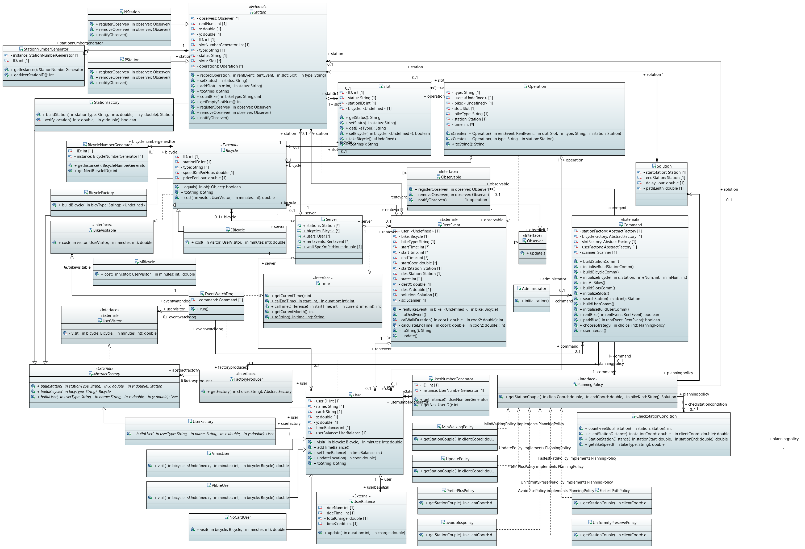

# myVelib - A Bike Sharing System

## 1. Introduction
### 1.1 Context
Bike-sharing offers users bike-on-demand service at an affordable price. It’s a very good way to improve urban mobility and it brings citizens convenience. Nowadays, bike-sharing is more and more a good solution for short distance traffic, with the advantage of flexible to the traffic condition, low carbon emission and healthy. Bike- sharing is also considered as the solution of solving the last-mile transport problem.

Velib is a large-scale public bicycle sharing system in Paris, France. According to Wikipedia, the system encompassed around 14,500 bicycles and 1,2300 bicycle stations, located across Paris and in some surrounding municipalities, with an average daily ridership of 85,811 in 2011.

The goal is to build the visual Velib management system(which is called MyVelib with JAVA Virtual Machine. 

### 1.2 Components of velib system

- <ins>**Station:**</ins> a station is where bicycles can be rented and dropped. It consists of a
  number of parking slots where bikes are stored and of a terminal which users can interact with in order for renting bicycles. Parking slots can be be occupied by a bicycle, free or out-of-order. A station is located in a specific place specified by GPS coordinates. 

    A station can be on service or offline: if it is offline all of its parking bays as well as the terminal cannot be used. 
    
  There exist two types of stations, a “_standard_” type, and a “_plus_” type. When a user who hold a Velib card drops a bicycle to a “plus” station it earns 5 minutes credits in its time balance. Each station has a unique numerical ID and so each parking slot (within a station) has a unique numerical ID.

- <ins>**Bicycle**</ins>: there exists two kind of bicycles, mechanical and electrical. Each bicycle has a unique numerical ID. 

- <ins>**User**</ins>: has a name, a unique numerical ID, a geographical position (GPS coordinates) and might have a registration card. In case a user holds a card she has also a time- credit balance (expressed in minutes) representing the credit gained by returning bicycles to “plus” stations. The time credit is used to compute the actual cost of a bike ride. 

- <ins>**Cards**</ins>: there are two kinds of registration cards: Vlibre and Vmax

### 1.2 Policies
#### 1.2.1 Cost
- if a user has no card the cost is 1 Euro per hour (for mechanical bikes) and 2 Euro per hour (for electrical bikes)

- if a user has a Vlibre card the cost is: 0 Euro for the first hour then 1E per each successive hour (for mechanical) and 1 Euro for the first hour then 2E per each successive hour (for electrical bikes). If a ride lasts longer than 60min the actual time balance exceeding 60min is computed by deducing from the user’s time-credit (if any). For example a user’s time-credit is 20min and the ride lasts 75min, then the user won’t be charged any extra min (beyond 1h) but it’s time-credit will be updated to 5min (deducing the 15min in excess to the free hour). On the other hand if the ride lasts 135min, the user will be charged for 135-20 = 115min, hence for the 55min in excess of an hour, and so on.

- if a user has Vmax card the cost is: 0 Euro for the first hour then 1E per each successive hour (independently of the kind of bike)

####  1.2.2 Planning

The myVelib system must provide the user with a functionality for planning a ride from a starting location to a destination location. Given the starting and destination GPS coordinates such functionality will identify the “optimal” source and destination stations from/to where the bike should be taken/dropped. The computation of the “optimal” stations for a given ride should fulfil the following criteria:

- the source, respectively the destination, station, for a ride should as close as possible to the starting, respectively to the destination, location of the ride.

- the source station should have one bike of the desired kind (electrical or mechanical) available for renting

- the destination station should have at least one free parking slot.

<ins>**Policies for ride planning:**</ins>The myVelib system should support the following policies for determining the plan of a ride:

• **minimal walking distance:** the pickup and return stations are chosen so that the total walking distance of the trip (i.e. the walking distance to reach the station where a bike is picked up from the starting point s plus the walking distance to reach the destination point d from the station where the bike is returned) is minimal.

• **fastest path to destination:** the pickup station is chosen so that the combined walk+ride delay to the destination point d is minimal whereas the return station is chosen so that the walking distance to destination point d is minimal (i.e. pickup and return stations are chosen independently of one another). The total delay associated to the pickup station and destination point d should be established assuming that the average walking speed is 4 Km/h while the average bicycle-riding speed is 15 Km/h, for mechanical bikes, and 20 Km/h for electrical bikes.

• **avoid “plus” stations:** like minimal walking distance but return station cannot be a “plus” station

• **prefer “plus” stations:** with this policy the return station should be a “plus” station (given a “plus” station no further away than 10% of the distance of the closest station to the destination location exists). If no such a “plus” station exists then this policy behaves normally (as a minimal walking distance).

## 2. Core Architecture Design
Factory pattern is used for instantiate new objects, while singleton pattern is used for creating unique numbers. 

For cost calculation, visitor pattern is applied while imposing observer pattern for notifying users the change of his/her destination station. In the end, strategy pattern is the best choice for generating route plan considering users’ different demands.

In order to store the data properly, a class Server is created as shown below which contains all of the necessary information of users, stations, bicycles and rent orders. 

## 3. Use case scenarios

### 3.0 Setting up of myVelib

By running the two _main_ function in the class Main.java, the two following features are implemented:

### 3.1 Administration CLI
The command line interpreter provides the user with a (linux-style) terminal like environ- ment to enter commands to interact with the myVelib core. The list of commands supported by the myVelib CLUI can be executed.

• setup <velibnetworkName>: to create a myVelib network with given name and consisting of 10 stations each of which has 10 parking slots and such that stations are arranged on a square grid whose of side 4km and initially populated with a 75% bikes randomly distributed over the 10 stations

• addUser <userName,cardType, velibnetworkName> : to add a user with name userName and card cardType (i.e. ‘‘none’’ if the user has no card) to a myVelib net- work velibnetworkName

• offline <velibnetworkName, stationID> : to put offline the station stationID of the myVelib network velibnetworkName

• online <velibnetworkName, stationID> : to put online the station stationID of the myVelib network velibnetworkName

• rentBike <userID, stationID> : to let the user userID renting a bike from station stationID (if no bikes are available should behave accordingly)

• returnBike <userID, stationID, time> : to let the user userID returning a bike to station stationID at a given instant of time time (if no parking bay is available should behave accordingly). This command should display the cost of the rent

• displayStation<velibnetworkName, stationID> : to display the statistics (as of Section 2.4) of station stationID of a myVelib network velibnetwork.

• displayUser<velibnetworkName, userID> : to display the statistics (as of Sec- tion 2.4) of user userID of a myVelib network velibnetwork.

• sortStation<velibnetworkName, sortpolicy> : to display the stations in increas- ing order w.r.t. to the sorting policy (as of Section 2.4) of user sortpolicy.

• display <velibnetworkName>: to display the entire status (stations, parking bays, users) of an a myVelib network velibnetworkName.

### 3.2 Simulation of n planning ride
1. n users at a given position require a ride planning to reach a destination position
2. each user receives the source and destination stations
3. each user retrieve a bicycle from the source station of the planned ride at a given instant of time
4. each destination station of the ride plan gets offline
5. each user receive a notification about the destination station of his ride plan to be unavailable

